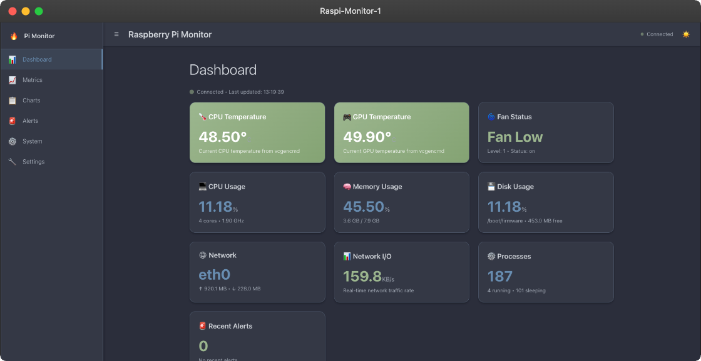
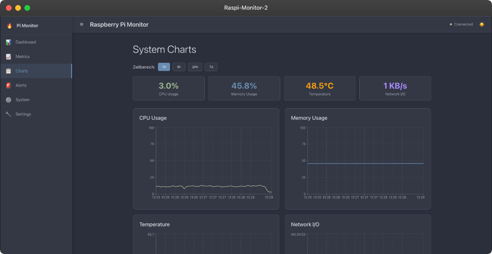
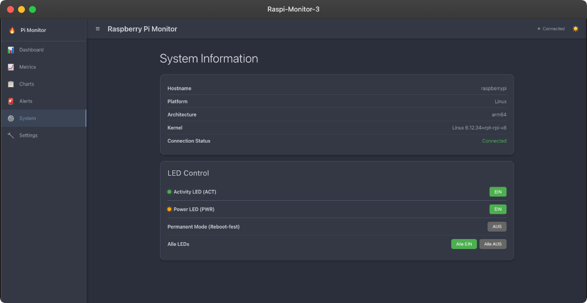

# 📊 Raspberry Pi Monitor

Eine moderne Echtzeit-Systemüberwachung für Raspberry Pi mit eleganter Benutzeroberfläche und historischen Datenanalysen.

## 🎨 Mockups

<div align="center">
  
  <br><br>
  
  <br><br>
  
</div>

## ✨ Features

- **📈 Echtzeit-Monitoring**: Live-Überwachung von CPU, Speicher, Festplatte und Netzwerk (1-Sekunden-Updates)
- **📊 Historische Charts**: Interaktive Datenvisualisierung mit Recharts (1h, 6h, 24h, 7d)
- **⚡ Task Manager**: Vollständige Prozess-Überwachung mit sortbaren Spalten (CPU, RAM, Netzwerk)
- **🔄 Intelligente Sortierung**: Einfache Ein-Klick-Sortierung (aufsteigend/absteigend) ohne komplexe Mehrfachsortierung
- **🌀 Lüfter-Status**: Raspberry Pi 5 Lüfterüberwachung (Level 0-4)
- **💡 LED-Kontrolle**: Raspberry Pi LED-Steuerung (ACT/PWR) temporär und permanent
- **🔥 Modern Dark Theme**: Elegante Benutzeroberfläche mit Material Design
- **📱 Responsive**: Optimiert für Desktop und mobile Geräte
- **🚀 WebSocket**: Echtzeitübertragung der Systemdaten mit automatischer Wiederverbindung
- **🔧 REST API**: Vollständige API für Datenabfragen
- **📋 Alerts**: Intelligente Benachrichtigungen bei kritischen Systemzuständen
- **🌐 Network I/O**: Echtzeit-Netzwerktraffic in KB/s
- **🕐 Deutsche Zeitzone**: Korrekte Zeitanzeige (Europe/Berlin)
- **📲 PWA Support**: Installierbar als App mit optimierten Favicons für Samsung S24 Ultra

## 🖥️ Screenshots

### Dashboard
- Übersichtliche Anzeige aller Systemmetriken
- Farbcodierte Warnstufen (grün/gelb/rot)
- Live-Updates jede Sekunde
- Lüfter-Status und Temperaturüberwachung
- Echtzeit-Netzwerktraffic

### Metrics
- Detaillierte Systemstatistiken
- CPU, Memory, Disk und Network Metriken
- Prozess-Information und GPU-Status

### Charts
- Interaktive Diagramme mit Recharts
- Zeitbereich-Selektor (1h, 6h, 24h, 7d)
- Deutsche Zeitzone (Europe/Berlin)
- Responsive Design für alle Geräte

### Tasks
- **Vollständiger Prozess-Manager** mit echten System-Daten
- **Sortierbare Spalten**: CPU, RAM, Netzwerk-Aktivität
- **Ein-Klick-Sortierung**: Aufsteigend/Absteigend ohne komplexe Mehrfachsortierung
- **Auto-Refresh**: Alle 5 Sekunden mit Sortierung-Persistierung
- **Intelligente Netzwerk-Scores**: Basierend auf Prozesstyp und Aktivität
- **Gefilterte Anzeige**: Keine Kernel-Threads, nur relevante Prozesse
- **Process-Status**: PID, User, Command, RSS Memory, Status

### System
- **LED-Kontrolle**: Raspberry Pi ACT/PWR LEDs temporär und permanent steuern
- **System-Informationen**: Hostname, Platform, Architecture, Kernel
- **Connection-Status**: Live WebSocket-Verbindungsstatus

## 🛠️ Installation

### Voraussetzungen
- Node.js 16+ 
- MySQL/MariaDB
- PM2 (empfohlen für Produktion)

### Setup

1. **Repository klonen**
   ```bash
   git clone https://github.com/pepperonas/raspi-monitor.git
   cd raspi-monitor
   ```

2. **Backend einrichten**
   ```bash
   cd backend
   npm install
   
   # Umgebungsvariablen konfigurieren
   cp .env.example .env
   # .env bearbeiten mit deinen Datenbankdaten
   ```

3. **Datenbank initialisieren**
   ```bash
   # MySQL-Datenbank erstellen
   mysql -u root -p
   CREATE DATABASE raspi_monitor;
   
   # Tabellen werden automatisch beim ersten Start erstellt
   ```

4. **Frontend builden**
   ```bash
   cd ../frontend
   npm install
   npm run build
   ```

5. **Server starten**
   ```bash
   cd ../backend
   
   # Development
   npm run dev
   
   # Production mit PM2
   pm2 start src/server.js --name raspi-monitor
   ```

## 📋 Konfiguration

### Umgebungsvariablen (.env)
```env
# Server
PORT=4999
NODE_ENV=production

# ✅ AKTUELL AKTIV: 
# - Direkt-Zugriff über http://192.168.2.134:4999
# - App läuft direkt auf Port 4999 (PM2)

# Datenbank
DB_HOST=localhost
DB_PORT=3306
DB_NAME=raspi_monitor
DB_USER=your_user
DB_PASSWORD=your_password

# Logging
LOG_LEVEL=info
LOG_FILE=logs/app.log
ERROR_LOG_FILE=logs/error.log

# Alerts
ALERT_EMAIL=admin@example.com
SMTP_HOST=smtp.example.com
SMTP_PORT=587
SMTP_USER=your_email
SMTP_PASSWORD=your_password
```

### Systemd Service (Optional)
```ini
# /etc/systemd/system/raspi-monitor.service
[Unit]
Description=Raspberry Pi Monitor
After=network.target

[Service]
Type=simple
User=pi
WorkingDirectory=/home/pi/apps/raspi-monitor/backend
ExecStart=/usr/bin/node src/server.js
Restart=always
RestartSec=10
Environment=NODE_ENV=production

[Install]
WantedBy=multi-user.target
```

## 🚀 Verwendung

### Web-Interface
- **Dashboard**: `http://192.168.2.134:4999/`
- **Charts**: `http://192.168.2.134:4999/charts.html`
- **API**: `http://192.168.2.134:4999/api/`

### Zugriff
Die Monitor-App ist erreichbar über:
- **IP + Port**: `http://192.168.2.134:4999` (direkte Verbindung über PM2)

### API Endpoints

#### Metriken
- `GET /api/metrics/latest` - Aktuelle Systemdaten
- `GET /api/metrics/history?range=1h` - Historische Daten
- `GET /api/metrics/summary` - Zusammenfassung und Statistiken

#### System
- `GET /api/system/info` - Systeminformationen
- `GET /api/system/processes` - Laufende Prozesse mit Sortierung
- `GET /api/system/uptime` - System-Uptime-Informationen
- `POST /api/system/led-control` - Raspberry Pi LED-Steuerung
- `GET /api/health` - Gesundheitsstatus der Anwendung

#### Alerts
- `GET /api/alerts` - Aktuelle Benachrichtigungen
- `POST /api/alerts/test` - Test-Benachrichtigung senden

## 📊 Datensammlung

Das System sammelt folgende Metriken:

### CPU
- Auslastung pro Kern und gesamt
- Temperatur (vcgencmd)
- Frequenz (Min/Max/Current)
- Load Average (1min, 5min, 15min)

### Memory
- RAM-Nutzung (total/used/available/free)
- Swap-Nutzung
- Prozentuale Auslastung

### Disk
- Speicherplatz-Nutzung pro Filesystem
- Mount-Points und Inodes
- Verfügbarer Speicherplatz

### Network
- Bytes gesendet/empfangen pro Interface
- Echtzeit-Traffic-Rate (KB/s)
- Pakete, Fehler und Drops
- Interface-Geschwindigkeit und MTU

### GPU & System
- GPU-Temperatur (vcgencmd)
- GPU-Memory (falls verfügbar)
- **Lüfter-Status (Raspberry Pi 5)**:
  - Level 0-4 (Off/Low/Medium/High/Max)
  - Status (on/off/unknown)

### Processes
- **Echtzeit-Prozess-Monitoring** mit nativer ps-Sortierung
- **CPU/Memory-Nutzung** der ressourcenintensivsten Prozesse
- **Netzwerk-Aktivität-Scores** basierend auf Prozesstyp und CPU/Memory-Verbrauch
- **Filterung**: Kernel-Threads ausgeblendet, nur relevante User-Prozesse
- **Sortierung**: CPU (desc/asc), Memory (desc/asc), Network (desc/asc)
- **Auto-Update**: Alle 5 Sekunden mit Sortierung-Persistierung

## 🔧 Development

### Struktur
```
raspi-monitor/
├── backend/
│   ├── src/
│   │   ├── routes/          # API-Routen
│   │   ├── services/        # Business Logic
│   │   ├── models/          # Datenmodelle
│   │   └── utils/           # Hilfsfunktionen
│   ├── config/              # Konfiguration
│   └── logs/                # Log-Dateien
├── frontend/
│   ├── public/              # Statische Assets
│   ├── src/                 # React-Komponenten
│   └── build/               # Produktions-Build
└── docs/                    # Dokumentation
```

### Scripts
```bash
# Backend
npm run dev          # Development Server
npm run start        # Production Server  
npm run test         # Tests ausführen
npm run lint         # Code-Qualität prüfen

# Frontend
npm run build        # Produktions-Build
npm run dev          # Development Server
```

## 🐛 Troubleshooting

### Häufige Probleme

1. **"Failed to fetch" Fehler**
   - CSP-Einstellungen prüfen
   - Netzwerk-Konfiguration überprüfen
   - Browser-Konsole für Details

2. **Charts werden nicht angezeigt**
   - Chart.js CDN-Verfügbarkeit prüfen
   - Fallback-Modus wird automatisch aktiviert
   - Browser-Kompatibilität überprüfen

3. **Datenbankverbindung fehlgeschlagen**
   - Credentials in .env überprüfen
   - MySQL-Service läuft
   - Firewall-Einstellungen

### Logs
```bash
# Anwendungs-Logs
tail -f logs/app.log

# Error-Logs
tail -f logs/error.log

# PM2 Logs
pm2 logs raspi-monitor
```

## 📦 Installation & Download

### 🚀 Schnell-Installation (empfohlen)
```bash
curl -fsSL https://github.com/pepperonas/raspi-monitor/releases/latest/download/install.sh | bash
```

### 📥 Manueller Download
1. **Neueste Version herunterladen**: [Releases](https://github.com/pepperonas/raspi-monitor/releases)
2. **Archiv entpacken**: `tar -xzf raspi-monitor-v0.1.0.tar.gz`
3. **Installation starten**: `cd raspi-monitor-v0.1.0 && ./install.sh`

### 🔄 Update bestehender Installation
```bash
# Das Install-Script erkennt automatisch bestehende Installationen
curl -fsSL https://github.com/pepperonas/raspi-monitor/releases/latest/download/install.sh | bash
```

### 🛠️ Für Entwickler
```bash
# Version erhöhen und Release erstellen
node scripts/version-manager.js release patch

# Nur Version erhöhen (ohne Release)
node scripts/version-manager.js bump minor

# Status anzeigen
node scripts/version-manager.js status
```

## 📝 Changelog

### Version 0.1.0 (September 2025 - Aktuell)
- ✅ **Task Manager**: Vollständiger Prozess-Manager mit echten System-Daten
- ✅ **Intelligente Sortierung**: Ein-Klick CPU/RAM/Netzwerk-Sortierung (aufsteigend/absteigend)
- ✅ **Native ps-Integration**: Backend nutzt native ps-Sortierung für perfekte Performance
- ✅ **Netzwerk-Scores**: Intelligente Netzwerk-Aktivität basierend auf Prozesstyp
- ✅ **Auto-Refresh**: 5-Sekunden-Updates mit Sortierung-Persistierung
- ✅ **Process-Filtering**: Kernel-Threads herausgefiltert, nur relevante User-Prozesse
- ✅ **LED-Kontrolle**: Raspberry Pi ACT/PWR LED-Steuerung (temporär/permanent)
- ✅ **System-Optimierung**: Saubere Trennung von System- und Task-Management
- ✅ **Netzwerk-Fix**: IP-Adresse auf 192.168.2.134:4999 aktualisiert
- ✅ **Firewall-Setup**: iptables-Regel für externen Zugriff konfiguriert

### Version 2.1 (August 2025)
- ✅ **Favicon-Optimierung**: Vollständige Samsung S24 Ultra-Kompatibilität für Homescreen-Verknüpfungen
- ✅ **PWA-Enhancement**: Erweiterte Meta-Tags und Icons für optimale mobile App-Erfahrung
- ✅ **Manifest.json Update**: Korrekte Icon-Pfade für alle verfügbaren Favicon-Größen

### Version 2.0
- ✅ Echtzeit-WebSocket-Verbindungen
- ✅ Interaktive Chart.js-Diagramme  
- ✅ Raspberry Pi 5 Lüfter-Überwachung
- ✅ MySQL-Datenbank-Integration
- ✅ Responsive Material Design UI

### Version 1.0
- ✅ Basis-Systemüberwachung
- ✅ REST API-Implementierung
- ✅ PM2-Integration

## 🤝 Contributing

1. Fork das Repository: https://github.com/pepperonas/raspi-monitor/fork
2. Feature-Branch erstellen: `git checkout -b feature/AmazingFeature`
3. Änderungen committen: `git commit -m 'Add AmazingFeature'`
4. Branch pushen: `git push origin feature/AmazingFeature`
5. Pull Request erstellen: https://github.com/pepperonas/raspi-monitor/compare

## 🐛 Issues & Support

- **Bug Reports**: https://github.com/pepperonas/raspi-monitor/issues
- **Feature Requests**: https://github.com/pepperonas/raspi-monitor/issues/new
- **Discussions**: https://github.com/pepperonas/raspi-monitor/discussions

## 📜 Lizenz

MIT License - siehe [LICENSE](https://github.com/pepperonas/raspi-monitor/blob/main/LICENSE) für Details.

## 🙏 Danksagungen

- **Chart.js** für die Datenvisualisierung
- **Express.js** für das Backend-Framework
- **MySQL** für die Datenspeicherung
- **PM2** für Process Management

## 🌟 Show your support

Gib dem Projekt einen ⭐ wenn es dir gefällt!

[](https://github.com/pepperonas/raspi-monitor/stargazers)
[](https://github.com/pepperonas/raspi-monitor/network/members)
[](https://github.com/pepperonas/raspi-monitor/issues)
[](https://github.com/pepperonas/raspi-monitor/blob/main/LICENSE)

---

Made with ❤️ by Martin Pfeffer