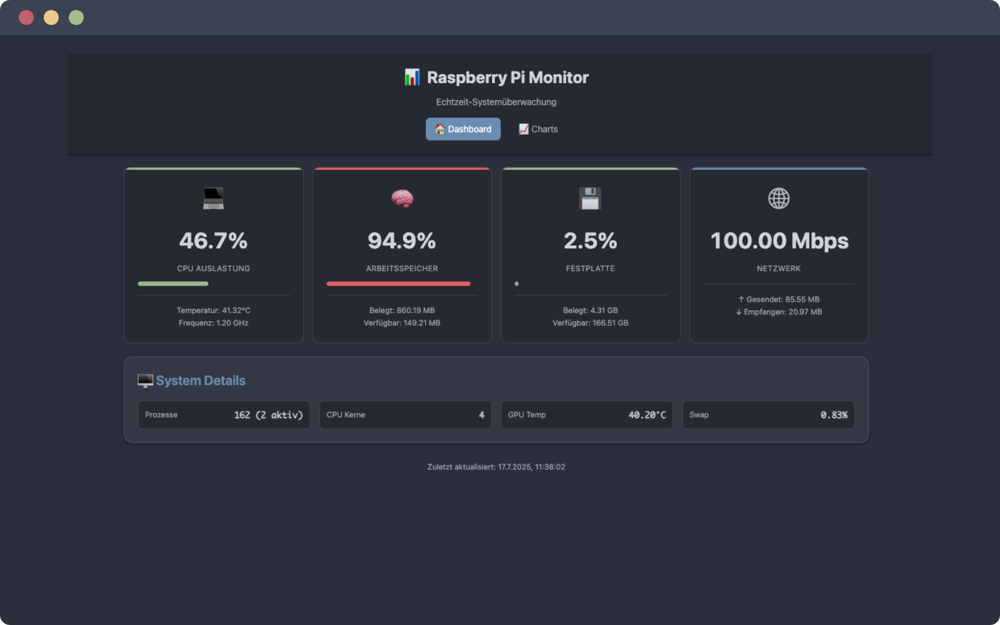
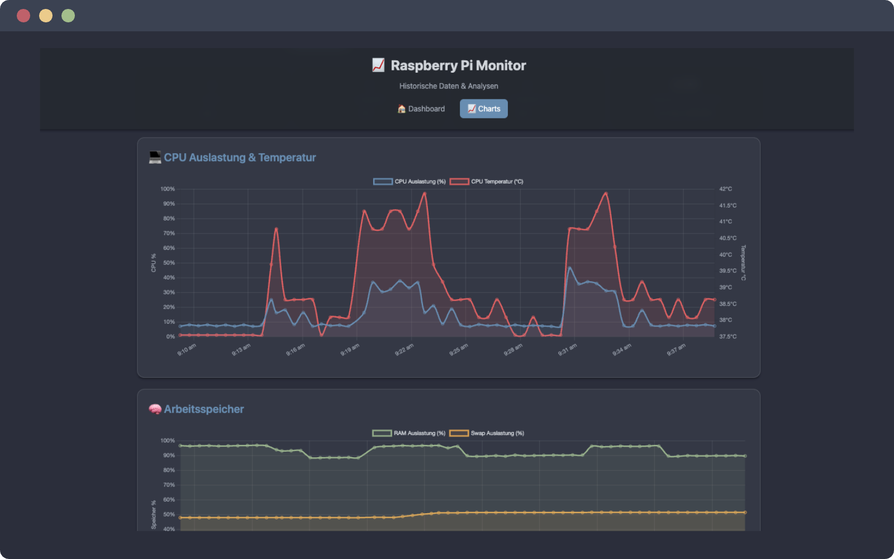

# 📊 Raspberry Pi Monitor

Eine moderne Echtzeit-Systemüberwachung für Raspberry Pi mit eleganter Benutzeroberfläche und historischen Datenanalysen.

## 🎨 Mockups

<div align="center">
  
  <br><br>
  
</div>

## ✨ Features

- **📈 Echtzeit-Monitoring**: Live-Überwachung von CPU, Speicher, Festplatte und Netzwerk
- **📊 Historische Charts**: Datenvisualisierung mit verschiedenen Zeiträumen (1h, 6h, 24h, 7d, 30d)
- **⚡ Stromverbrauch**: Automatische Berechnung und Kostenanalyse des Energieverbrauchs
- **🌙 Dark Theme**: Moderne Benutzeroberfläche im fog-controller Design
- **📱 Responsive**: Optimiert für Desktop und mobile Geräte
- **🚀 WebSocket**: Echtzeitübertragung der Systemdaten
- **🔧 REST API**: Vollständige API für Datenabfragen
- **📋 Alerts**: Intelligente Benachrichtigungen bei kritischen Systemzuständen

## 🖥️ Screenshots

### Dashboard
- Übersichtliche Anzeige aller Systemmetriken
- Farbcodierte Warnstufen (grün/gelb/rot)
- Live-Updates alle 5 Sekunden

### Charts
- Interaktive Diagramme mit Chart.js
- Zeitbereich-Selektor für flexible Datenansicht
- Stromverbrauchsanalyse mit Kostenschätzung

## 🛠️ Installation

### Voraussetzungen
- Node.js 16+ 
- MySQL/MariaDB
- PM2 (empfohlen für Produktion)

### Setup

1. **Repository klonen**
   ```bash
   git clone https://github.com/pepperonas/raspi-monitor.git
   cd raspi-monitor
   ```

2. **Backend einrichten**
   ```bash
   cd backend
   npm install
   
   # Umgebungsvariablen konfigurieren
   cp .env.example .env
   # .env bearbeiten mit deinen Datenbankdaten
   ```

3. **Datenbank initialisieren**
   ```bash
   # MySQL-Datenbank erstellen
   mysql -u root -p
   CREATE DATABASE raspi_monitor;
   
   # Tabellen werden automatisch beim ersten Start erstellt
   ```

4. **Frontend builden**
   ```bash
   cd ../frontend
   npm install
   npm run build
   ```

5. **Server starten**
   ```bash
   cd ../backend
   
   # Development
   npm run dev
   
   # Production mit PM2
   pm2 start src/server.js --name raspi-monitor
   ```

## 📋 Konfiguration

### Umgebungsvariablen (.env)
```env
# Server
PORT=4999
NODE_ENV=production

# Datenbank
DB_HOST=localhost
DB_PORT=3306
DB_NAME=raspi_monitor
DB_USER=your_user
DB_PASSWORD=your_password

# Logging
LOG_LEVEL=info
LOG_FILE=logs/app.log
ERROR_LOG_FILE=logs/error.log

# Alerts
ALERT_EMAIL=admin@example.com
SMTP_HOST=smtp.example.com
SMTP_PORT=587
SMTP_USER=your_email
SMTP_PASSWORD=your_password
```

### Systemd Service (Optional)
```ini
# /etc/systemd/system/raspi-monitor.service
[Unit]
Description=Raspberry Pi Monitor
After=network.target

[Service]
Type=simple
User=pi
WorkingDirectory=/home/martin/apps/raspi-monitor/backend
ExecStart=/usr/bin/node src/server.js
Restart=always
RestartSec=10
Environment=NODE_ENV=production

[Install]
WantedBy=multi-user.target
```

## 🚀 Verwendung

### Web-Interface
- **Dashboard**: `http://your-pi-ip:4999/`
- **Charts**: `http://your-pi-ip:4999/charts.html`
- **API**: `http://your-pi-ip:4999/api/`

### API Endpoints

#### Metriken
- `GET /api/metrics/latest` - Aktuelle Systemdaten
- `GET /api/metrics/history?range=1h` - Historische Daten
- `GET /api/metrics/summary` - Zusammenfassung und Statistiken

#### System
- `GET /api/system/info` - Systeminformationen
- `GET /api/health` - Gesundheitsstatus der Anwendung

#### Alerts
- `GET /api/alerts` - Aktuelle Benachrichtigungen
- `POST /api/alerts/test` - Test-Benachrichtigung senden

## 📊 Datensammlung

Das System sammelt folgende Metriken:

### CPU
- Auslastung pro Kern
- Temperatur
- Frequenz
- Anzahl Prozesse

### Speicher
- RAM-Nutzung
- Swap-Nutzung
- Verfügbarer Speicher

### Festplatte
- Speicherplatz-Nutzung
- I/O-Statistiken
- Mount-Points

### Netzwerk
- Übertragungsraten
- Bytes gesendet/empfangen
- Netzwerk-Interfaces

### Stromverbrauch
- Geschätzte Leistungsaufnahme
- Tägliche/monatliche Kosten
- Energieeffizienz-Trends

## 🔧 Development

### Struktur
```
raspi-monitor/
├── backend/
│   ├── src/
│   │   ├── routes/          # API-Routen
│   │   ├── services/        # Business Logic
│   │   ├── models/          # Datenmodelle
│   │   └── utils/           # Hilfsfunktionen
│   ├── config/              # Konfiguration
│   └── logs/                # Log-Dateien
├── frontend/
│   ├── public/              # Statische Assets
│   ├── src/                 # React-Komponenten
│   └── build/               # Produktions-Build
└── docs/                    # Dokumentation
```

### Scripts
```bash
# Backend
npm run dev          # Development Server
npm run start        # Production Server  
npm run test         # Tests ausführen
npm run lint         # Code-Qualität prüfen

# Frontend
npm run build        # Produktions-Build
npm run dev          # Development Server
```

## 🐛 Troubleshooting

### Häufige Probleme

1. **"Failed to fetch" Fehler**
   - CSP-Einstellungen prüfen
   - Netzwerk-Konfiguration überprüfen
   - Browser-Konsole für Details

2. **Charts werden nicht angezeigt**
   - Chart.js CDN-Verfügbarkeit prüfen
   - Fallback-Modus wird automatisch aktiviert
   - Browser-Kompatibilität überprüfen

3. **Datenbankverbindung fehlgeschlagen**
   - Credentials in .env überprüfen
   - MySQL-Service läuft
   - Firewall-Einstellungen

### Logs
```bash
# Anwendungs-Logs
tail -f logs/app.log

# Error-Logs
tail -f logs/error.log

# PM2 Logs
pm2 logs raspi-monitor
```

## 🤝 Contributing

1. Fork das Repository: https://github.com/pepperonas/raspi-monitor/fork
2. Feature-Branch erstellen: `git checkout -b feature/AmazingFeature`
3. Änderungen committen: `git commit -m 'Add AmazingFeature'`
4. Branch pushen: `git push origin feature/AmazingFeature`
5. Pull Request erstellen: https://github.com/pepperonas/raspi-monitor/compare

## 🐛 Issues & Support

- **Bug Reports**: https://github.com/pepperonas/raspi-monitor/issues
- **Feature Requests**: https://github.com/pepperonas/raspi-monitor/issues/new
- **Discussions**: https://github.com/pepperonas/raspi-monitor/discussions

## 📜 Lizenz

MIT License - siehe [LICENSE](https://github.com/pepperonas/raspi-monitor/blob/main/LICENSE) für Details.

## 🙏 Danksagungen

- **Chart.js** für die Datenvisualisierung
- **Express.js** für das Backend-Framework
- **MySQL** für die Datenspeicherung
- **PM2** für Process Management

## 🌟 Show your support

Gib dem Projekt einen ⭐ wenn es dir gefällt!

[](https://github.com/pepperonas/raspi-monitor/stargazers)
[](https://github.com/pepperonas/raspi-monitor/network/members)
[](https://github.com/pepperonas/raspi-monitor/issues)
[](https://github.com/pepperonas/raspi-monitor/blob/main/LICENSE)

---

Made with ❤️ by Martin Pfeffer